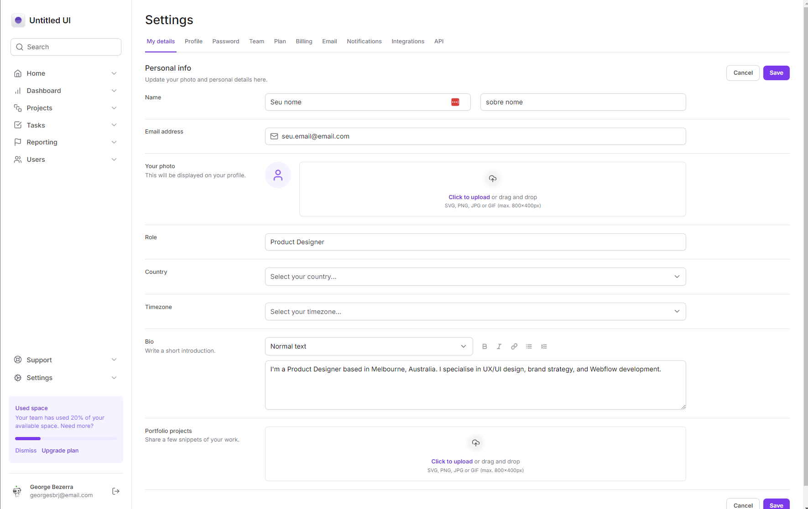

 ## Dashboard - boiler-plate  

   
 

## Tecnologias utilizadas

 
- [**Next**](https://nextjs.org/): Framework Next.js utilizado para a estrutura e organização do projeto;
- [**Tailwind**](https://tailwindcss.com/): Framework CSS que facilita o desenvolvimento de interfaces modernas e responsivas.

## Licença

Este projeto está licenciado sob a licença MIT - consulte o arquivo LICENSE para mais detalhes.